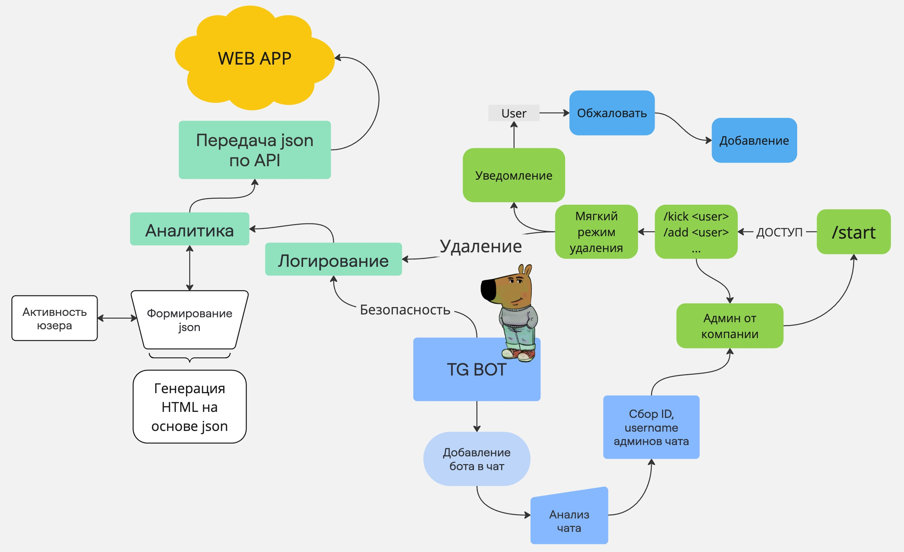

<<<<<<< HEAD

=======
# ПРОЕКТ TG_BOT - автоматизация модерирования рабочих чатов 🙂

## Реализованная функциональность:

## Особенности проекта:

## Основной стек технологий:

## Зависимости

## Разработали

    1. Бабков Мирослав Витальевич
    2. Пугаченко Максим Романович
    3. Золотарев Даниил Романович
    4. Лушников Дмитрий Анатольевич
    5. Супонев Никита Сергеевич
